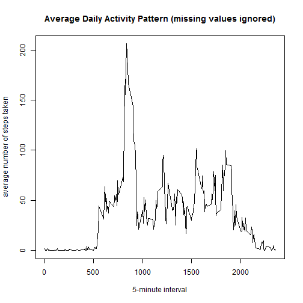
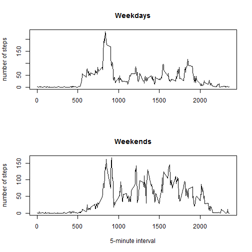

## 0. Prerequisites.
The csv data file should exist in the working directory.


```r
fileDataName <- "./activity.csv"

if(file.exists(fileDataName)){
  print("csv data file found, ready to load")
} else {
  stop("csv data file not found, execution terminated")
}
```

```
## [1] "csv data file found, ready to load"
```


## 1. Loading and preprocessing the data.
### 1.1. Load the data.
Data are loaded from the **./activity.csv** file.


```r
activityData <- read.csv(fileDataName, header = TRUE)
```

### 1.2. Process/transform the data into a format suitable for analysis.
The format of the date field is converted.

```r
activityData$date <- as.Date(activityData$date,format="%Y-%m-%d")
```
A *summary* of the data loaded is presented.

```r
summary(activityData)
```

```
##      steps             date               interval     
##  Min.   :  0.00   Min.   :2012-10-01   Min.   :   0.0  
##  1st Qu.:  0.00   1st Qu.:2012-10-16   1st Qu.: 588.8  
##  Median :  0.00   Median :2012-10-31   Median :1177.5  
##  Mean   : 37.38   Mean   :2012-10-31   Mean   :1177.5  
##  3rd Qu.: 12.00   3rd Qu.:2012-11-15   3rd Qu.:1766.2  
##  Max.   :806.00   Max.   :2012-11-30   Max.   :2355.0  
##  NA's   :2304
```

```r
str(activityData)
```

```
## 'data.frame':	17568 obs. of  3 variables:
##  $ steps   : int  NA NA NA NA NA NA NA NA NA NA ...
##  $ date    : Date, format: "2012-10-01" "2012-10-01" ...
##  $ interval: int  0 5 10 15 20 25 30 35 40 45 ...
```


```r
startDate <- min(activityData$date)
endDate <- max(activityData$date)
totalNumberOfDays <- as.numeric(endDate - startDate +1)
```
Data collection starts on **2012-10-01**, ends on **2012-11-30**, and lasts **61** days.

## 3. What is mean total number of steps taken per day?
**Note**: missing values in the dataset are here ignored.

### 3.1. Make a histogram of the total number of steps taken each day.
For each day the total number of steps is calculated. A *summary* is presented and then a histogram is
plotted.

```r
totalDailyActivityData <- tapply(activityData$steps, activityData$date, sum)

summary(totalDailyActivityData)
```

```
##    Min. 1st Qu.  Median    Mean 3rd Qu.    Max.    NA's 
##      41    8841   10760   10770   13290   21190       8
```

```r
hist(totalDailyActivityData,
     main = "Total Number of Steps Taken Each Day (missing values ignored)",
     xlab = "total number of steps taken",
     ylab = "number of days")
```

 

### 3.2. Calculate and report the mean and median total number of steps taken per day.

```r
meanTotalStepsPerDay <- mean(totalDailyActivityData, na.rm = TRUE)
print(meanTotalStepsPerDay)
```

```
## [1] 10766.19
```

```r
medianTotalStepsPerDay <- median(totalDailyActivityData, na.rm = TRUE)
print(medianTotalStepsPerDay)
```

```
## [1] 10765
```

The **mean** total number of steps taken per day is **10766.19** steps per day.

The **median** total number of steps taken per day is **10765** steps per day.

## 4. What is the average daily activity pattern?
**Note**: missing values in the dataset are here ignored.

### 4.1. Make a time series plot of the 5-minute interval (x-axis) and the average number of steps taken, averaged across all days (y-axis).
For each 5-minute interval, the number of steps taken is averaged across all days. A *summary* is presented and the time series plot is displayed. 

```r
meanStepsInFiveMin <- tapply(activityData$steps, activityData$interval, mean, na.rm = TRUE)

summary(meanStepsInFiveMin)
```

```
##    Min. 1st Qu.  Median    Mean 3rd Qu.    Max. 
##   0.000   2.486  34.110  37.380  52.830 206.200
```

```r
plot(names(meanStepsInFiveMin), meanStepsInFiveMin, type = "l",
     main = "Average Daily Activity Pattern (missing values ignored)",
     xlab = "5-minute interval",
     ylab = "average number of steps taken")
```

 

### 4.2. Which 5-minute interval, on average across all the days in the dataset, contains the maximum number of steps?

```r
maxSteps <- max(meanStepsInFiveMin)
maxInterval <- which.max(meanStepsInFiveMin)
print(maxInterval)
```

```
## 835 
## 104
```
Averaging across all days in the dataset, the 5-minute interval starting at time **8:35** (interval number **104**) has the maximum value for the average number of steps taken (**206.17** steps in 5 minutes).

## 5. Imputing missing values
### 5.1. Calculate and report the total number of missing values in the dataset (i.e. the total number or rows with NA's).
Missing values (NA's) exist in *steps* observations. The number of missing values is already known from the output of *summary*, anyhow it is calculated again.

```r
totalNAs <- sum(is.na(activityData$steps))
print(totalNAs)
```

```
## [1] 2304
```
The total number of missing values (*steps* observations), is **2304**.

### 5.2. Devise a strategy for filling in all the missing values in the dataset.
**Description of the strategy**.
*If the number of steps taken in a 5-minute interval on a specific day is missing, then the average value across all days for the same 5-minute interval is used. In other words, the average daily activity pattern is applied to fill in missing values. Additionally, in order to have homogeneous integer values for the number of steps, the average value is rounded to the closest integer.* 

### 5.3. Create a new dataset that is equal to the original dataset but with the missed data filled in.
Applying the above strategy, a substitution vector is created by replication of the average daily activity pattern.


```r
naSubstitutionVector <- round(rep(meanStepsInFiveMin, totalNumberOfDays), digits = 0)
```

The new dataset with no missing data is created. A *summary* of the new dataset is presented.

```r
activityData1 <- activityData
activityData1$steps[is.na(activityData$steps)] <- naSubstitutionVector[is.na(activityData$steps)]

summary(activityData1)
```

```
##      steps             date               interval     
##  Min.   :  0.00   Min.   :2012-10-01   Min.   :   0.0  
##  1st Qu.:  0.00   1st Qu.:2012-10-16   1st Qu.: 588.8  
##  Median :  0.00   Median :2012-10-31   Median :1177.5  
##  Mean   : 37.38   Mean   :2012-10-31   Mean   :1177.5  
##  3rd Qu.: 27.00   3rd Qu.:2012-11-15   3rd Qu.:1766.2  
##  Max.   :806.00   Max.   :2012-11-30   Max.   :2355.0
```

```r
str(activityData1)
```

```
## 'data.frame':	17568 obs. of  3 variables:
##  $ steps   : num  2 0 0 0 0 2 1 1 0 1 ...
##  $ date    : Date, format: "2012-10-01" "2012-10-01" ...
##  $ interval: int  0 5 10 15 20 25 30 35 40 45 ...
```

#### 5.4.1. Make a histogram of the total number of steps taken each day.
The histogram is plotted.

```r
totalDailyActivityData1 <- tapply(activityData1$steps, activityData1$date, sum)
summary(totalDailyActivityData1)
```

```
##    Min. 1st Qu.  Median    Mean 3rd Qu.    Max. 
##      41    9819   10760   10770   12810   21190
```

```r
hist(totalDailyActivityData1,
     main = "Total Number of Steps Taken Each Day (after missing data imputed)",
     xlab = "total number of steps taken",
     ylab = "number of days")
```

 
####  5.4.2. Calculate and report the mean and the median total number of steps taken per day.
Mean and median are reported for the new dataset.


```r
meanTotalStepsPerDay1 <- mean(totalDailyActivityData1)
print(meanTotalStepsPerDay1)
```

```
## [1] 10765.64
```

```r
medianTotalStepsPerDay1 <- median(totalDailyActivityData1)
print(medianTotalStepsPerDay1)
```

```
## [1] 10762
```
The **mean** total number of steps taken per day is **10765.64** steps per day.

The **median** total number of steps taken per day is **10762.00** steps per day.

#### 5.4.3. Do these values differ from the estimates from the first part of the assignment?
A comparison table is created.


```r
library(xtable)
table <- data.frame(c(meanTotalStepsPerDay, medianTotalStepsPerDay),
                    c(meanTotalStepsPerDay1, medianTotalStepsPerDay1),
                    c(meanTotalStepsPerDay-meanTotalStepsPerDay1,
                      medianTotalStepsPerDay-medianTotalStepsPerDay1))
colnames(table) <- c("NA's ignored", "NA's filled in", "delta")
rownames(table) <- c("mean", "median")

xtab <- xtable(table)
print(xtab, type = "html")
```

<!-- html table generated in R 3.2.1 by xtable 1.7-4 package -->
<!-- Sun Jul 19 16:15:49 2015 -->
<table border=1>
<tr> <th>  </th> <th> NA's ignored </th> <th> NA's filled in </th> <th> delta </th>  </tr>
  <tr> <td align="right"> mean </td> <td align="right"> 10766.19 </td> <td align="right"> 10765.64 </td> <td align="right"> 0.55 </td> </tr>
  <tr> <td align="right"> median </td> <td align="right"> 10765.00 </td> <td align="right"> 10762.00 </td> <td align="right"> 3.00 </td> </tr>
   </table>

#### 5.4.4. What is the impact of imputing missing data on the estimates of the total daily number of steps?
Considering the relative low value of the difference (see the *delta* column int the above table) between the case with NA's ignored and the case with NA's filled in, we can initially suppose that the impact of the substitution startegy applied is negligible.

## 6. Are there differences in activity patterns between weekdays and weekends?
### 6.1. Create a new factor variable in the dataset with two levels -- "weekday" and "weekend" indicating whether a given date is a weekday or a weekend day.
A new factor variable with two levels ("weekend" and "weekday") is created. (Note: Italian weekday names are used: sabato = Saturday, domenica = Sunday.)

```r
dayOfTheWeek <- weekdays(activityData1$date)
typeOfDay <- dayOfTheWeek
typeOfDay[typeOfDay == "sabato" | typeOfDay == "domenica"] <- "weekend"
typeOfDay[typeOfDay != "weekend"] <- "weekday"

typeOfDay <- as.factor(typeOfDay)
```

The new factor variable is added to the dataset and a *summary* is presented

```r
activityData1 <- data.frame(activityData1, typeOfDay)
summary(activityData1)
```

```
##      steps             date               interval        typeOfDay    
##  Min.   :  0.00   Min.   :2012-10-01   Min.   :   0.0   weekday:12960  
##  1st Qu.:  0.00   1st Qu.:2012-10-16   1st Qu.: 588.8   weekend: 4608  
##  Median :  0.00   Median :2012-10-31   Median :1177.5                  
##  Mean   : 37.38   Mean   :2012-10-31   Mean   :1177.5                  
##  3rd Qu.: 27.00   3rd Qu.:2012-11-15   3rd Qu.:1766.2                  
##  Max.   :806.00   Max.   :2012-11-30   Max.   :2355.0
```

```r
str(activityData1)
```

```
## 'data.frame':	17568 obs. of  4 variables:
##  $ steps    : num  2 0 0 0 0 2 1 1 0 1 ...
##  $ date     : Date, format: "2012-10-01" "2012-10-01" ...
##  $ interval : int  0 5 10 15 20 25 30 35 40 45 ...
##  $ typeOfDay: Factor w/ 2 levels "weekday","weekend": 1 1 1 1 1 1 1 1 1 1 ...
```

For each 5-minute interval, the number of steps taken averaged across all weekdays is calculated and a *summary* is presented.

```r
activityDataWd <- activityData1[typeOfDay == "weekday",]
meanStepsInFiveMinWd <- tapply(activityDataWd$steps, activityDataWd$interval, mean)
summary(meanStepsInFiveMinWd)
```

```
##    Min. 1st Qu.  Median    Mean 3rd Qu.    Max. 
##   0.000   2.289  25.810  35.610  50.810 230.400
```

For each 5-minute interval, the number of steps taken averaged across all weekend days is calculated and a *summary* is presented.

```r
activityDataWe <- activityData1[typeOfDay == "weekend",]
meanStepsInFiveMinWe <- tapply(activityDataWe$steps, activityDataWe$interval, mean)
summary(meanStepsInFiveMinWe)
```

```
##    Min. 1st Qu.  Median    Mean 3rd Qu.    Max. 
##   0.000   1.234  32.310  42.360  74.610 166.600
```

A *panel plot* comparing *"weekday"* days and *"weekend"* days is presented (base R plotting system is used).

```r
par(mfrow = c(2,1))
plot(names(meanStepsInFiveMinWd), meanStepsInFiveMinWd, type = "l",
     main = "Weekdays",
     xlab = "",
     ylab = "number of steps")
plot(names(meanStepsInFiveMinWe), meanStepsInFiveMinWe, type = "l",
     main = "Weekends",
     xlab = "5-minute interval",
     ylab = "number of steps")
```

 

Qualitatively, activity pattern during weekdays appears to be clearly different than activity pattern during weekend days. Number of steps taken for 5-minute interval is more evenly distributed during the day in the weekend than in a weekday.  On the othe side a peak value is tipically registered in a weekday and not during the weekend. Quantitatively, the average number of steps for 5-minute interval is greater during weekend days than during weekdays. Further investigation is anyhow needed before reaching any conlusion.
